# Active Directory Infrastructure Lab – Windows Server 2022

An enterprise-style on-premises Active Directory lab built using Windows Server 2022 in VMware Workstation Pro.  
This project demonstrates structured Organizational Unit (OU) design, Role-Based Access Control (RBAC), Group Policy enforcement, centralized file and printer services, and validation from domain-joined client systems.

---

## Table of Contents

1. [Overview](#overview)
2. [Prerequisites](#prerequisites)
3. [Architecture](#architecture)
4. [Active Directory Design](#active-directory-design)
5. [Users and Groups (RBAC)](#users-and-groups-rbac)
6. [File Server Configuration](#file-server-configuration)
7. [Group Policy Implementation](#group-policy-implementation)
8. [Drive Mapping via GPO](#drive-mapping-via-gpo)
9. [User Restriction Policy – Control Panel](#user-restrictions-policy)
10. [USB Security Enforcement](#Workstation-Security-Policy-USB-StorageControl)
11. [Printer Deployment](#Print-Server-and-Printer-Deployment)
12. [Validation and Testing](#Validation-Outcome)

---

## Overview

This project simulates a real-world enterprise Active Directory environment commonly managed by system administrators.  
It focuses on centralized identity management, access control, security policy enforcement, and automated resource deployment using Microsoft Windows Server technologies.

The lab emphasizes **practical administration skills** rather than theoretical configuration.

---

## Prerequisites

Before setting up the lab, ensure the following software and tools are available:

1. **VMware Workstation Pro**
2. **Windows Server 2022 ISO**
3. **Windows 10 / Windows 11 ISO**
4. **Basic networking knowledge (DNS, DHCP, IP addressing)**
5. **PowerShell (built into Windows Server)**

---

## Architecture

### Domain

### Virtual Machines

| VM Name | Role |
|------|------|
| DC01 | Domain Controller, DNS, Group Policy |
| FS01 | File Server, Print Server |
| CLIENT01 | Domain-joined workstation |

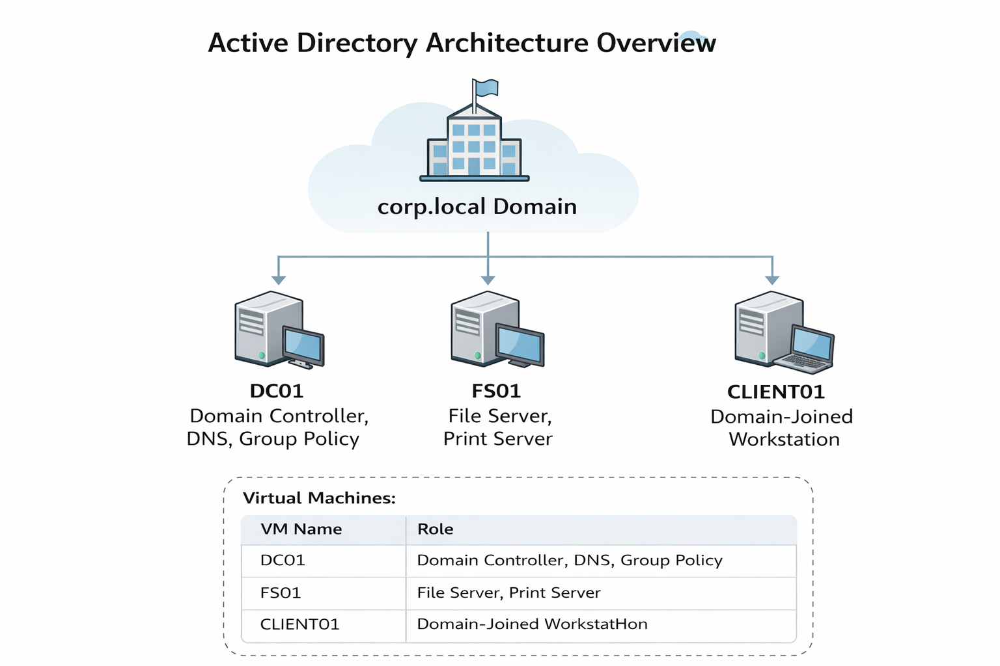

---

## Active Directory Design

### Organizational Unit (OU) Structure

A structured OU hierarchy was implemented to enable scalable administration and clean Group Policy targeting.

**OU Design Rationale**
- **Admins** – Administrative user accounts  
- **Servers** – Member servers (File / Print servers)  
- **Workstations** – Domain-joined client systems  
- **CorpUsers** – Standard users organized by department  
- **Groups** – Security groups used for RBAC and policy targeting

**Execute Script :  AD_OU-structure**

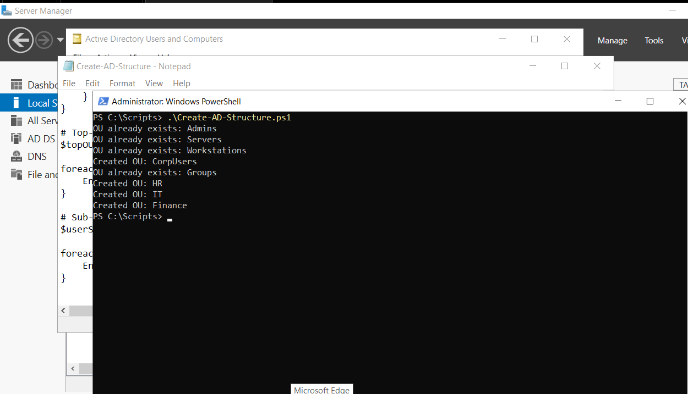

---

## Users and Groups (RBAC)

Adding users to the Organizational Units created.

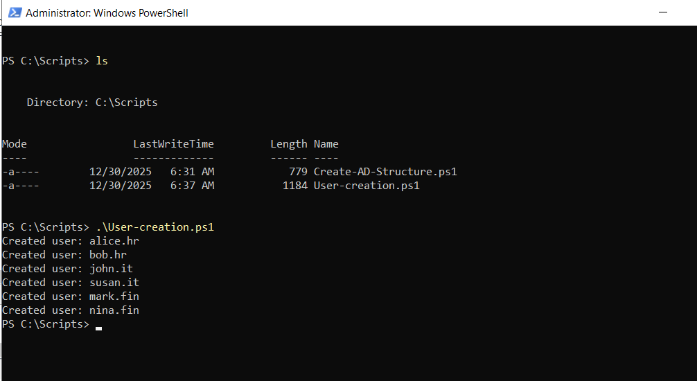

Execute the Script : User_Creation

### Security Groups & Role-Based Access Control (RBAC)

Role-Based Access Control (RBAC) was implemented by assigning permissions to **security groups** instead of individual users, ensuring scalability, consistency, and simplified access management.

| **Group Name**          | **Purpose**                          |
|-------------------------|--------------------------------------|
| **HR_Read**             | Read-only access to HR data           |
| **Finance_Modify**      | Modify access to Finance data         |
| **IT_Admin**            | Administrative privileges            |
| **Workstation_Users**   | Standard domain workstation users    |

Execute group.ps1 in Scripts 

- `Finance_Modify`
- `HR_Read`
- `IT_Admin`
- `Workstation_Users`

## File Server Configuration

A centralized file server (**FS01**) was configured and joined to the domain.

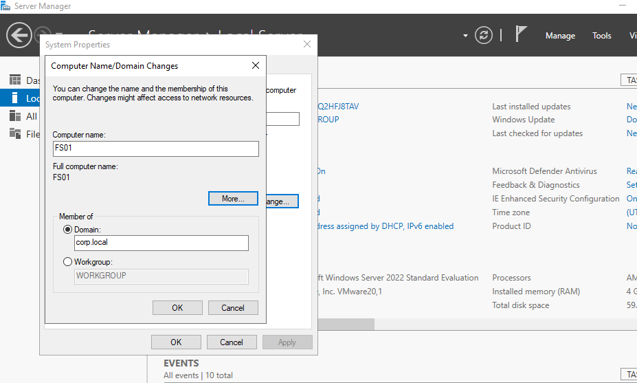

### Shared Folders

| Share | Path | Access |
|----|----|----|
| Finance | `C:\Shares\Finance` | Finance_Modify – Modify |
| HR | `C:\Shares\HR` | HR_Read – Read |

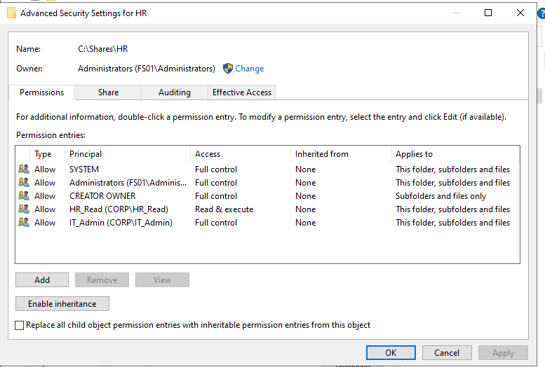
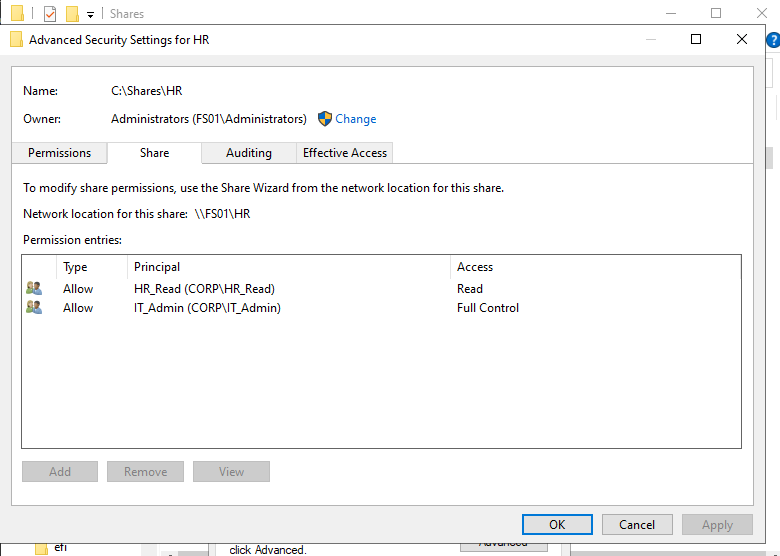

Share permissions were used to control network-level access, while NTFS permissions enforced granular file system security. Effective access was determined by the most restrictive combination of both permission sets, following Microsoft best practices.

- NTFS permissions enforced least-privilege access  
- Default permissions were removed  
- Access controlled strictly through security groups

  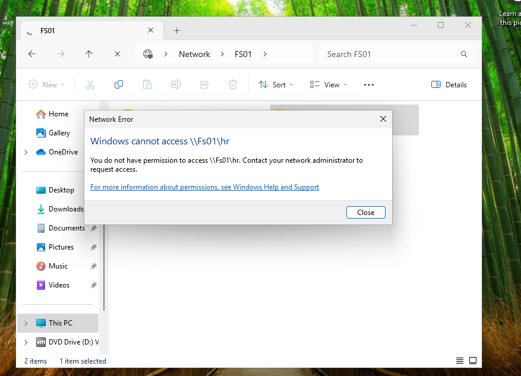

  Members of Finance_Modify Security group were denied access to HR Shared Folder

---

## Group Policy Implementation

### Domain Security Policies

- Applied at the domain level

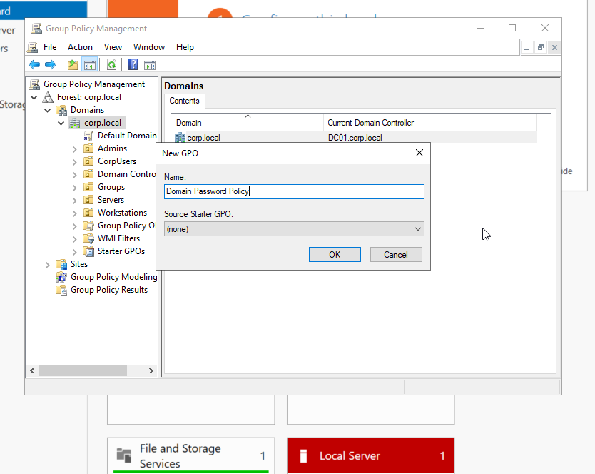

- Password complexity enforced

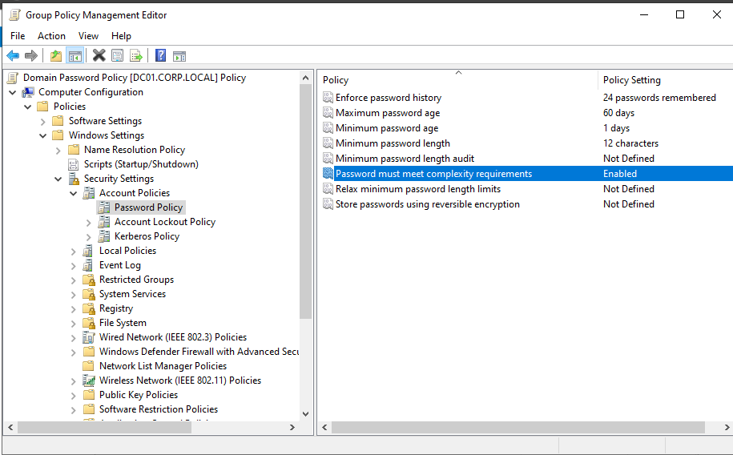

- Account lockout configured

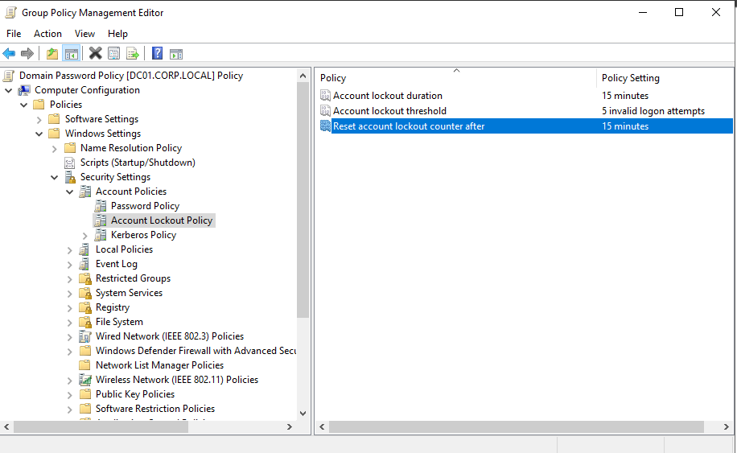

### User-Restrictions-Policy

A dedicated Group Policy Object (GPO) was created to enforce user-level restrictions and linked to the `CorpUsers` Organizational Unit. This ensures restrictions follow users regardless of the workstation they log into.

#### Policy Scope
- **Applied to:** `OU=CorpUsers`
- **Policy Type:** User Configuration

#### Configured Settings
- Prohibit access to Control Panel and Windows Settings

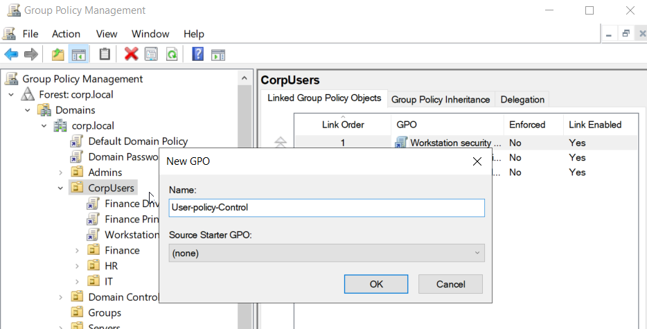

#### Policy Enforcement Result

When a standard domain user attempts to access the Control Panel or Windows Settings, access is denied as expected.

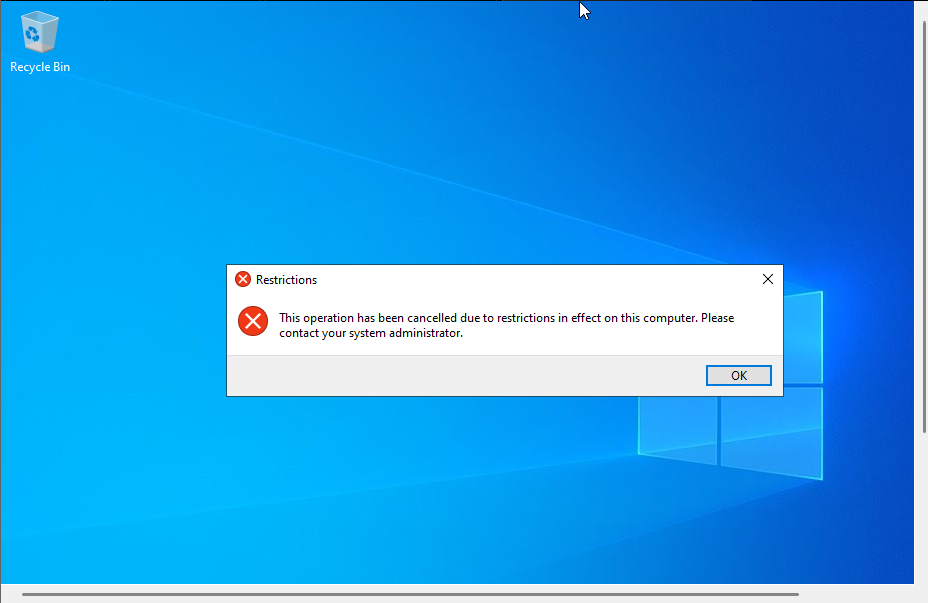

## Drive Mapping via GPO

Network drives were automated using **Group Policy Preferences**.

- Applied at user logon  
- Item-level targeting based on `Finance_Modify` security group  

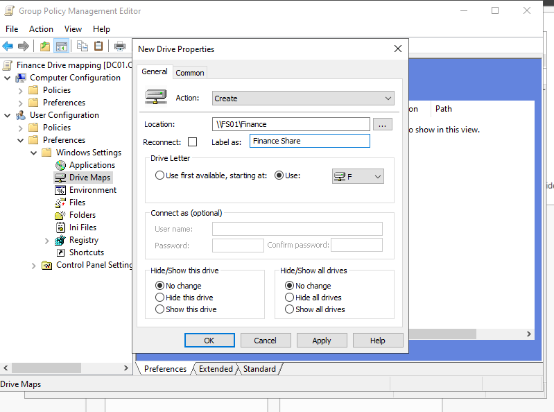
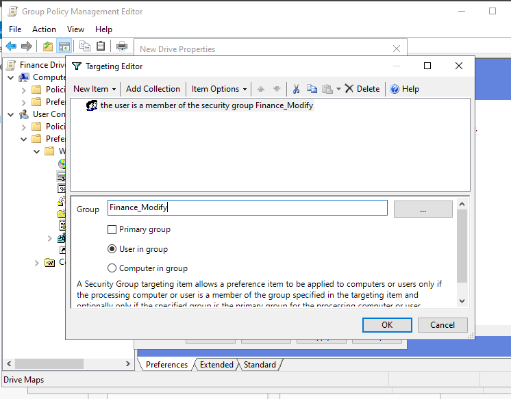

---

### Workstation-Security-Policy-USB-StorageControl

A computer-based Group Policy Object (GPO) was implemented to restrict the use of removable storage devices across all domain-joined workstations.

#### Policy Scope
- **Applied to:** `OU=Workstations`
- **Policy Type:** Computer Configuration

#### Configured Settings
- Deny all access to removable storage devices

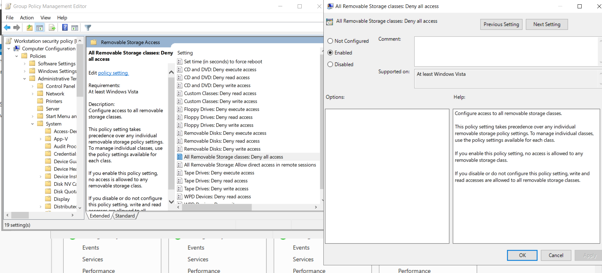
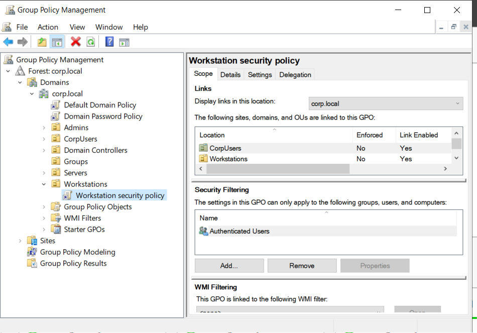

#### Policy Enforcement Result

When a USB storage device is inserted into a domain-joined workstation, access is blocked in accordance with the security policy.

---

## Print-Server-and-Printer-Deployment

A centralized print server was deployed to manage and distribute printers across the domain using Group Policy Preferences and Role-Based Access Control (RBAC).

### Print Server Setup
- Installed **Print and Document Services** role on the file server
- Configured shared printers for centralized management

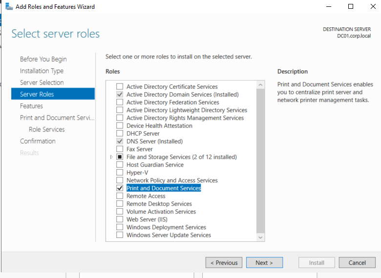
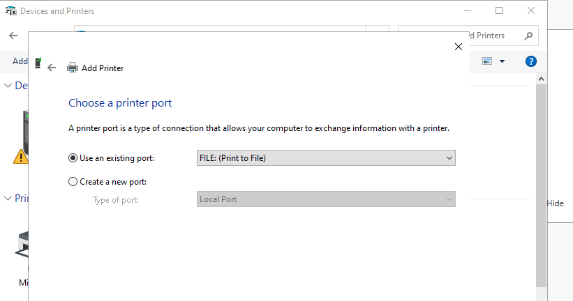

### Printer Configuration
A departmental printer was created and shared from the print server for Finance users.

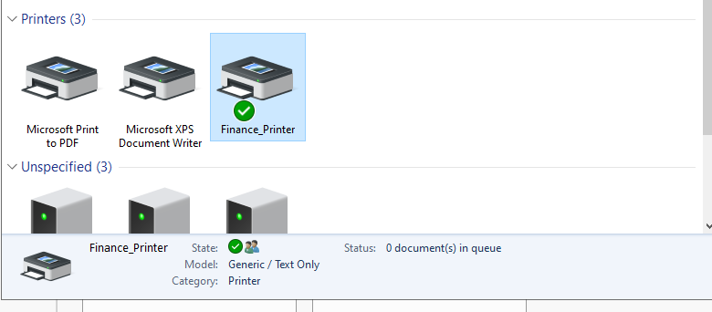

### Printer Deployment via Group Policy
Printers were deployed using Group Policy Preferences to automatically map printers at user logon.

- **Deployment Method:** Group Policy Preferences
- **Action:** Update
- **Share Path:** `\\FS01\Finance_Printer`

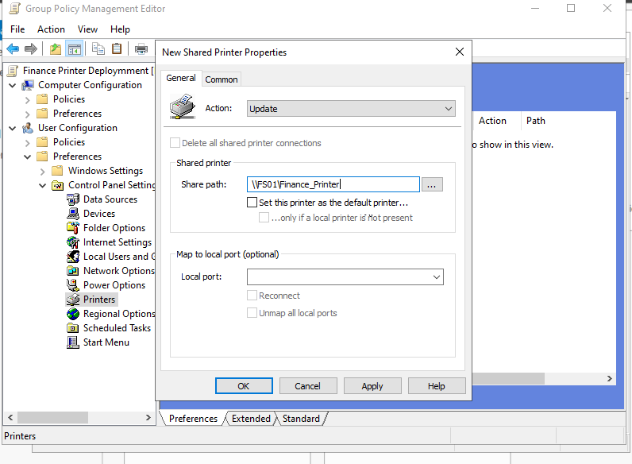

### RBAC-Based Targeting
Item-level targeting was used to ensure the printer is deployed only to authorized users.

- **Security Group:** `Finance_Modify`
- **Target Type:** User group membership

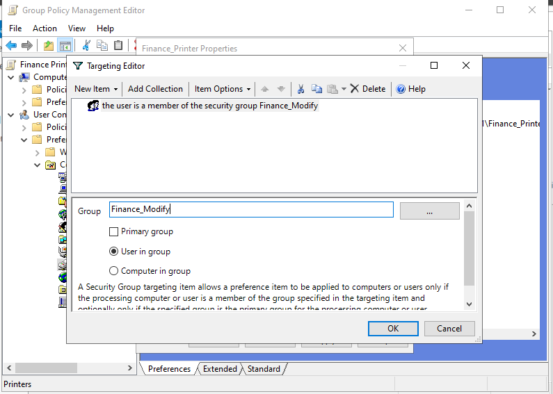

---

### Validation-Outcome

The applied Group Policy Objects (GPOs) were successfully validated across domain-joined client systems. Policy refresh and reporting confirmed that both user-based and computer-based configurations were applied as intended.

- `gpupdate /force` verified immediate policy application without errors.
- `gpresult /r` confirmed that the correct GPOs were applied to both user and computer scopes.
- `whoami /groups` validated Role-Based Access Control (RBAC) by confirming effective security group memberships during user sessions.

End-user testing further confirmed:
- Restricted access to Control Panel and system settings for standard users
- Blocked USB storage devices on managed workstations
- Automatic network drive mapping based on department membership
- Automatic printer deployment using security group targeting

These results demonstrate a correctly scoped, secure, and fully functional Active Directory environment aligned with enterprise best practices.

